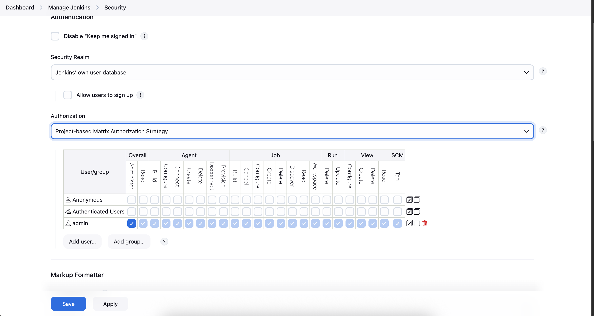

# 🌟 Task 76 - Grant Project-Based Permissions to Jenkins Users

**📌 Task Description**  
**xFusionCorp Industries** has onboarded new developers **sam** and **rohan**. They need specific access to the existing **Packages** Jenkins job. Use **Project-Based Matrix Authorization** with **ACL inheritance** to grant precise permissions.

**👉 Task Requirements**:  
- Access Jenkins UI and log in with **username**: `admin`, **password**: `Adm!n321`.  
- **Job**: `Packages`  
- **Users**:  
  - `sam` → `sam@pass12345`  
  - `rohan` → `rohan@pass12345`  
- Enable: **Project-based Matrix Authorization**  
- **Inheritance**: Inherit permissions from parent ACL  
- **Permissions**:  

| **User** | **Permissions** |
|----------|-----------------|
| sam | Build, Configure, Read |
| rohan | Build, Cancel, Configure, Read, Update, Tag |

---

## 🔹 Step 1: Access Jenkins UI

**Action**: Log in to Jenkins.  
**Purpose**: Gain admin access to configure security.

**Steps**:  
1. Click the **Jenkins** button in the top bar.  
2. Enter:  
   - **Username**: `admin`  
   - **Password**: `Adm!n321`  
3. Click **Log in**.

**Success Indicators**:  
- ✅ Dashboard loads.  
- ✅ Admin access confirmed.

---

## 🔹 Step 2: Install Required Plugin

**Action**: Install Project-based Matrix Authorization Strategy plugin.  
**Purpose**: Enable per-job permission control.

**Steps**:  
1. Go to **Manage Jenkins** → **Plugins** → **Available plugins**.  
2. Search: `Project-based Matrix Authorization Strategy`  
3. Select and install.  
4. Check **Restart Jenkins when installation is complete**.  
5. Re-login after restart.

**Success Indicators**:  
- ✅ Plugin installed.  
- ✅ New option appears in Security.

---

## 🔹 Step 3: Enable Project-Based Matrix Authorization

**Action**: Switch global authorization strategy.  
**Purpose**: Allow per-project permissions.

**Steps**:  
1. Go to **Manage Jenkins** → **Security**.  
2. Under **Authorization**, select:  
   - **Project-based Matrix Authorization Strategy**  
3. Add **admin** user with all permissions (check all boxes).  
4. Click **Save**.

**Success Indicators**:  
- ✅ Strategy changed.  
- ✅ Admin retains full access.

---

## 🔹 Step 4: Configure Packages Job Security

**Action**: Enable project-specific permissions.  
**Purpose**: Override global ACL with job-level control.

**Steps**:  
1. Go to **Dashboard** → Click **Packages** job.  
2. Click **Configure**.  
3. Scroll to **General** section.  
4. Check **Enable project-based security**.  
5. Under **Inheritance strategy**, select:  
   - **Inherit permissions from parent ACL**  
6. In the **Project-based Matrix Authorization** table:  
   - **Add user sam**:  
     - ✅ Read  
     - ✅ Build  
     - ✅ Configure  
   - **Add user rohan**:  
     - ✅ Read  
     - ✅ Build  
     - ✅ Configure  
     - ✅ Cancel  
     - ✅ Update  
     - ✅ Tag  
7. Click **Save**.

**Success Indicators**:  
- ✅ Permissions table shows correct checkboxes.  
- ✅ Inheritance enabled.

---

## 🔹 Step 5: Verify User Login & Permissions

**Action**: Test access as sam and rohan.  
**Purpose**: Confirm permissions are enforced.

**Steps**:  

### **Test as sam**:
1. Open incognito → Go to Jenkins URL.  
2. Login: `sam` / `sam@pass12345`  
3. Go to **Packages** job.  
4. Verify:  
   - ✅ Can read job  
   - ✅ Can build  
   - ✅ Can configure  
   - ❌ Cannot cancel, update, or tag  

### **Test as rohan**:
1. Login: `rohan` / `rohan@pass12345`  
2. Go to **Packages** job.  
3. Verify:  
   - ✅ Can read, build, configure  
   - ✅ Can cancel, update, tag  

**Success Indicators**:  
- ✅ sam: 3 permissions.  
- ✅ rohan: 6 permissions.  
- ✅ No extra access.

---

## 🔹 Step 6: Document the Process

**Action**: Capture all configuration steps and verification results.  
**Purpose**: Audit and compliance.

**Steps**:  
1. Document all configuration details:  
   - Login credentials  
   - Plugin installation  
   - Global authorization (Project-based Matrix)  
   - Packages → Enable project-based security  
   - Full permission table  
   - sam and rohan login views  

**Success Indicator**:  
- ✅ Full documentation completed.

---

## 📋 Quick Reference Guide

**Jenkins UI Steps**:  
1. **Login**: `admin` / `Adm!n321`  
2. **Install**: Project-based Matrix Authorization Strategy → Restart  
3. **Manage Jenkins** → **Security** → Select **Project-based Matrix**  
4. Grant **admin** all permissions  
5. Open **Packages** → **Configure**  
6. Check **Enable project-based security**  
7. **Inheritance**: Inherit from parent ACL  
8. **Add users & permissions**:  

| **User** | **Read** | **Build** | **Configure** | **Cancel** | **Update** | **Tag** |
|----------|----------|-----------|---------------|------------|------------|---------|
| sam | Yes | Yes | Yes | No | No | No |
| rohan | Yes | Yes | Yes | Yes | Yes | Yes |

9. **Save** → Test with sam & rohan logins

---

## 💡 Common Issues & Fixes

### **Issue 1: Users Can't Log In**
**Problem**: Invalid username or password  
**Fix**:  
- Confirm users exist in **Manage Users**  
- Reset password if needed

### **Issue 2: No Permissions Visible**
**Problem**: Matrix table empty  
**Fix**:  
- Re-save global Project-based Matrix  
- Refresh job config

### **Issue 3: Inheritance Not Working**
**Problem**: Global permissions override job  
**Fix**:  
- Ensure **Inherit from parent ACL** is checked  
- Don't use Deny rules globally

---

## 🔧 Troubleshooting Access Issues

### **Error: Access Denied**
**Symptoms**: 403 on job page  
**Solution**:  
- Check project-based security is enabled  
- Verify user spelling in matrix

### **Error: Configure Button Missing**
**Symptoms**: No gear icon  
**Solution**:  
- Confirm **Configure** permission is checked  
- Clear browser cache

---

## 🚨 Task-Specific Challenge & Solution

**🔍 Main Challenge Encountered**:  
Granting fine-grained, per-job permissions to two users while inheriting global ACL.

**💡 Solution Approach**:  
1. Enabled Project-based Matrix Authorization globally  
2. Activated project-based security on Packages  
3. Used inheritance to maintain consistency  
4. Assigned exact permissions via matrix table  
5. Validated with real user logins

**🎯 Key Success Factors**:  
- Correct plugin and strategy  
- Inheritance enabled  
- sam: 3 permissions  
- rohan: 6 permissions  
- No over-permissioning

**⚠️ Critical Fixes**:  
- Added admin to global matrix first  
- Used exact user names  
- Enabled project-based security  
- Tested in incognito

**🔒 Best Practices Applied**:  
- Least privilege principle  
- ACL inheritance for consistency  
- Per-job security isolation  
- User acceptance testing  
- Full audit trail

**⚠️ Important Troubleshooting Concepts**:  
- Always save global before job config  
- Use incognito to avoid session mix  
- Check **System Log** for auth errors  
- Verify user exists in Jenkins

---

## ⚠️ Important Production Notes

🔧 **Security**: Never grant Administer at job level  
🔐 **Auditing**: Enable Audit Trail plugin  
📊 **Consistency**: Use Role Strategy for 10+ jobs  
🛡️ **Backup**: Export job config XML  
📹 **Review**: Quarterly permission audit

---

## ✅ Task Completion Checklist

- [ ] Logged into Jenkins with `admin`/`Adm!n321`  
- [ ] Installed Project-based Matrix Authorization Strategy plugin  
- [ ] Enabled Project-based Matrix Authorization globally  
- [ ] Added admin user with all permissions  
- [ ] Opened Packages job configuration  
- [ ] Enabled project-based security on Packages job  
- [ ] Set inheritance to "Inherit permissions from parent ACL"  
- [ ] Added sam with Read, Build, Configure permissions  
- [ ] Added rohan with Read, Build, Configure, Cancel, Update, Tag permissions  
- [ ] Saved job configuration  
- [ ] Tested sam login and verified 3 permissions  
- [ ] Tested rohan login and verified 6 permissions  
- [ ] Documented all steps  

**🎉 Success Criteria Met When**:  
- Project-based Matrix Authorization is enabled globally  
- Packages job has project-based security enabled  
- sam can Read, Build, and Configure the Packages job  
- rohan can Read, Build, Configure, Cancel, Update, and Tag the Packages job  
- Both users can log in successfully  
- No unauthorized permissions granted

